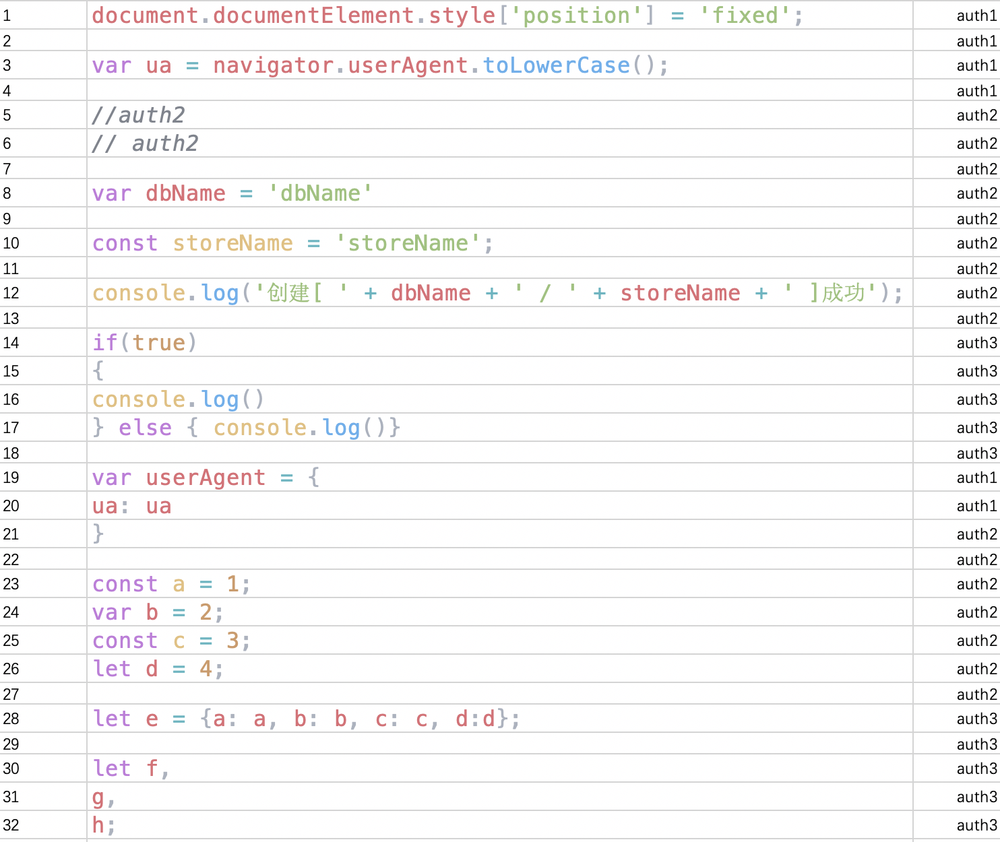
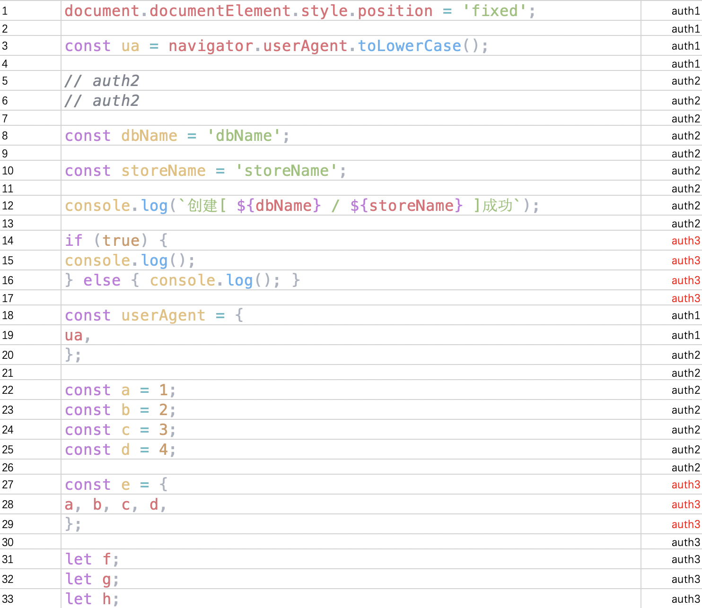
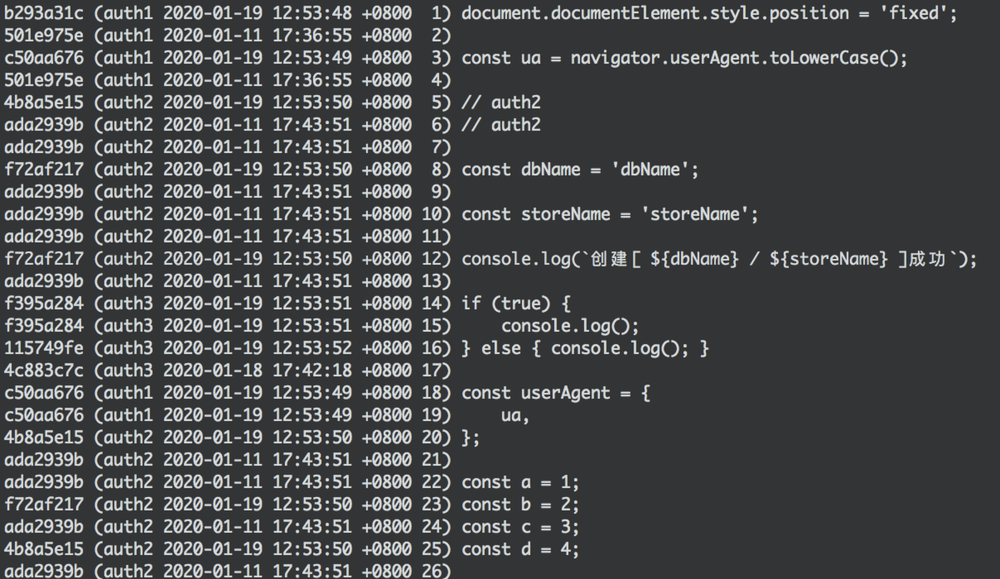
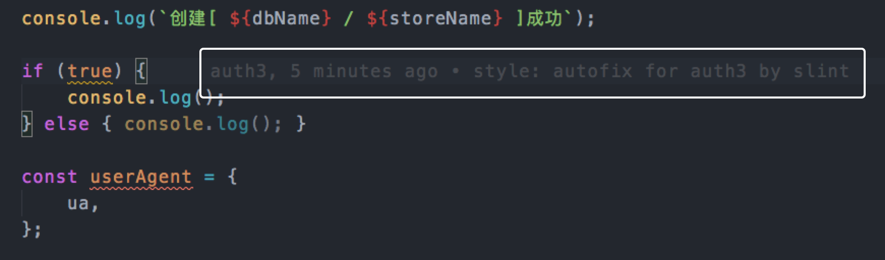
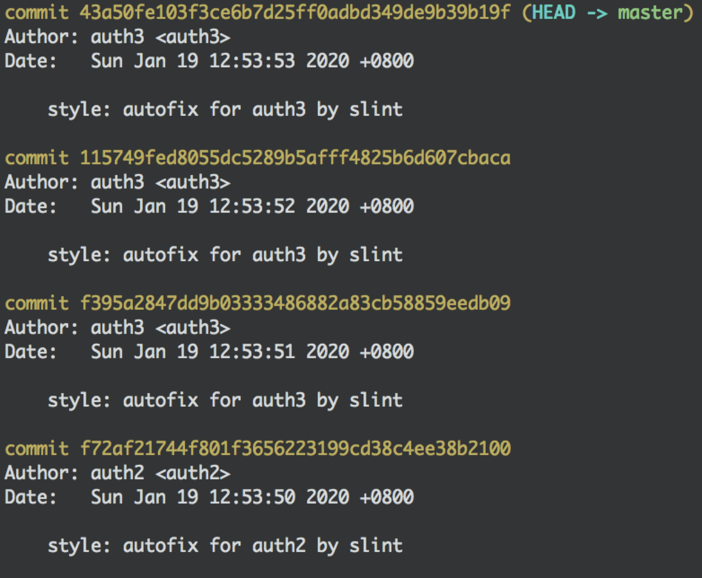
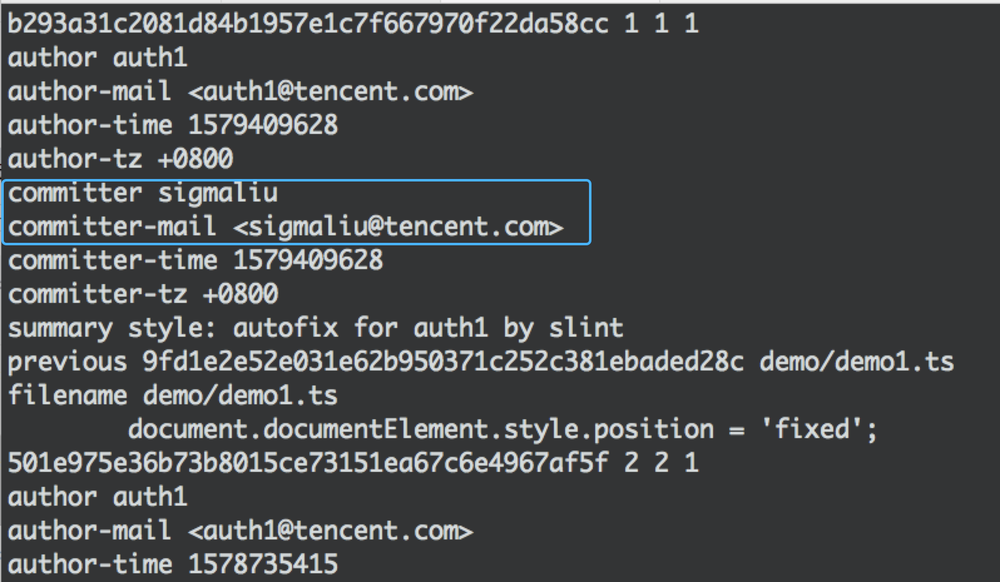

# [AlloyLint](https://github.com/AlloyTeam/AlloyLint)
[](https://github.com/AlloyTeam)
[](https://github.com/AlloyTeam/AlloyLint/blob/master/tsconfig.json/LICENSE)

ESLint 自动修复拓展插件，自动保留最后修改人

## 📎 为什么有这个插件？

基于两个痛点：

- 运行 `ESLint --fix` 后，git 提交记录变成了运行修复命令的人员，为后续的修改追踪带来很大的麻烦
- 在 `lint-staged` 里使用 `ESLint --fix`，如果有无法修复的问题，将会报错，阻断后面的提交流程

## 🔬 原理

- 使用 `ESLint CLIEngine` 提供的 Node API 收集文件信息
- 通过 `CLIEngine` 的 `fix` 参数定制输出报告
- `git blame` 获取行和修改人信息映射
- `git commit --author` 指定提交人员


## 📢 使用者指南

### 一、全局安装

如果要对存量代码做修复，一般全局安装

```sh
npm install alloylint -g
```

### 二、本地安装

如果要对项目后面的代码做约束和修复，选择本地安装

```sh
npm install alloylint -D
```

### 三、在 npm script 使用

```sh
"lint": "alloylint file.js"
```

支持 glob 模式:

```sh
"lint": "alloylint './src/**/*'"
```

更多 glob 模式的写法，可以参考 [minimatch](https://github.com/isaacs/minimatch#usage)

### 四、配合 lint-staged 使用

在 `lint-staged` 使用 AlloyLint 可以在提交代码的时候自动运行自动修复，尽可能地修复可修复问题。

1. 安装 `husky` 和 `lint-staged`

    ```sh
    npm install husky lint-staged -D
    ```

2. 添加以下内容到 `package.json` 里

    ```json
        "husky": {
            "hooks": {
                "pre-commit": "lint-staged"
            }
        },
        "lint-staged": {
            "*.{js,ts}": [
                "alloylint",
                "git add"
            ]
        }
    ```

### 五、保留最后修改人

添加 `-a` 或者 `--author` 参数

```sh
alloylint -a "./src/**/*"
```

------

## 🍗 效果

**假设原来有这样一段代码**



**在运行了 AlloyLint 后，可以看到 14 - 16 行，27 - 29 行即使有行列变动，依然能完整保留最后修改人的信息**



**git blame 工具仍维持这原修改人**



**编辑器里看到的也是经过我们处理过的最后修改人**



**git log 上看到的也都是按每个修改人去做的自动修复记录**



**在 git blame --line-porcelain 能同时看到修改人和提交人**



## 📂 目录和文件介绍

```
.
├── demo 测试文件
├── dist 编译后文件
├── docs 文档资源
├── script 编译和测试脚本
├── src 源码
```

## 🔧 贡献者指南

### 开发

1. 安装依赖
    ```sh
   npm i
   ```


2. 开发环境

   ```sh
   npm run dev
   ```

### 测试

1. 运行命令

   ```sh
   npm run demo:fixAuth
   ```


### 自举

1. AlloyLint 代码在 Commit 后会自动编译，并用编译后脚本格式化变动的代码文件，因此开发者不用关心这部分


## 💊 Issues

有什么好的建议或者遇到问题，请不吝到 [Issues](https://github.com/AlloyTeam/AlloyLint/issues) 提问题和讨论
